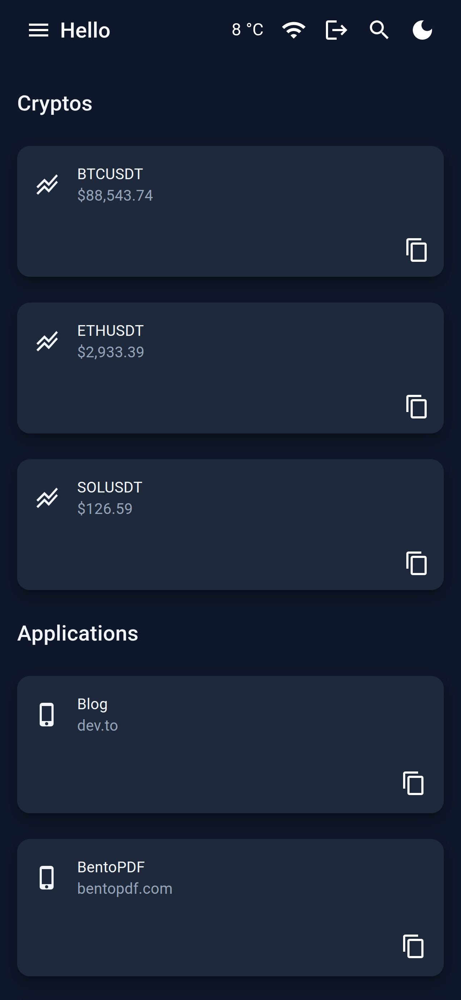
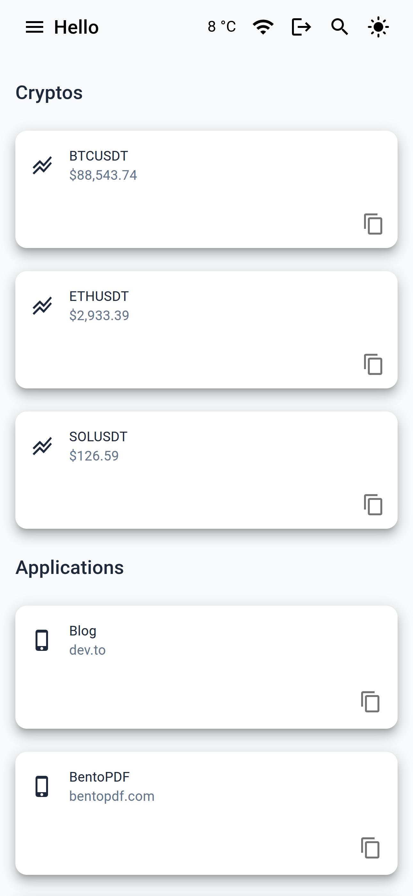

# 👋 Hello

Minimalist self-hosted dashboard

[](./LICENSE) [](https://github.com/aminnairi?tab=packages&repo_name=hello)



## Why Choose This Dashboard?

- **Fully Tailorable**: Effortlessly curate your workspace with apps, crypto, stocks, and weather.
- **Native Feel (PWA)**: Install it instantly on desktop or mobile for a seamless, app-like experience.
- **Smart Universal Search**: Quickly find assets or trigger a Google fallback when you need broader results.
- **Adaptive UI**: Beautiful Light and Dark themes that sync automatically with your system settings.
- **Tactile & Fluid**: Experience the interface through haptic feedback and smooth data-fetching animations.
- **Universal Responsiveness**: Precision-engineered to look stunning on smartphones, tablets, and desktops.
- **Secure Access**: Protect your dashboard with built-in authentication using a hashed password.
- **Instant Deployment**: Fully containerized, ensuring a "plug-and-play" setup in any environment.
- **Permanently Free**: Professional-grade performance at zero cost, forever.

## Usage

### Requirements

- [Docker](https://docker.com/)
- [Docker Compose](https://docker.com/compose)

### Configuration

```bash
touch settings.json
```

```json
{
  "applications": [
    {
      "name": "Excalidraw",
      "url": "https://excalidraw.com"
    },
    {
      "name": "Google Task",
      "url": "https://calendar.google.com/tasks"
    }
  ],
  "cryptos": [
    {
      "name": "Bitcoin",
      "ticker": "BTC"
    },
    {
      "name": "Ethereum",
      "ticker": "ETH"
    },
    {
      "name": "Solana",
      "ticker": "SOL"
    }
  ]
}
```

> [!TIP]
> You'll need to restart the containers before applying any update to the configuration above.

### Proxy Setup

```bash
touch default.conf
```

```nginx
server {
    listen 80;
    server_name 127.0.0.1 localhost your.domain.com;

    location / {
        proxy_pass http://hello-web:8001/;
    }

    location /api/ {
        proxy_pass http://hello-server:8000/;
    }
}
```

> [!NOTE]
> You can use any reverse proxy of your choice for this part.

### Docker Compose Setup

```bash
touch compose.yml
```

```yaml
services:
  hello-server:
    container_name: hello-server
    restart: unless-stopped
    image: ghcr.io/aminnairi/hello/server:0.1.0
    volumes:
      - ./settings.json:/home/node/settings.json
  hello-web:
    container_name: hello-web
    restart: unless-stopped
    image: ghcr.io/aminnairi/hello/web:0.1.0
    depends_on:
      - hello-server
  hello-proxy:
    container_name: hello-proxy
    restart: unless-stopped
    image: nginx:1.29.4-alpine3.23
    depends_on:
      - hello-server
      - hello-web
    volumes:
      - ./default.conf:/etc/nginx/conf.d/default.conf
    ports:
      - 80:80
```

> [!WARNING]
> If you have decided to use a different reverse proxy, you'll have to update your `compose.yml` file as well.

### Start

```bash
docker compose up -d
```

> [!TIP]
> It is highly recommended to run `docker compose logs` in order to see if any errors have occurred.

### Stop

```bash
docker compose down --remove-orphans --volumes --timeout 0
```

> [!NOTE]
> This won't remove any bind mount, only logical volumes if any are unused or orphans

### Settings

The `settings.json` file contains an object that gathers all the necessary parameters for the application to function properly.

#### Errors

If you are ever unsure for whether the `settings.json` file you have provided is correct or not (after an update for instance), feel free to run the `docker compose logs hello-server` command in order to display the errors that will be printed out in the terminal if any.

If you don't see any errors, congrats: Your settings have been parsed and read correctly!

> [!IMPORTANT]
> The `settings.json` file is not watched for changes, so if you ever need to update your `settings.json` file, restart the service before running the Web application again.

```jsonc
{
  //...
}
```

#### Authentication

The `authentication` property allow you to define parameters that will be used for securing the access to the Web application.

> [!TIP]
> This property is optional and you can remove it entirely from your configuration if you don't need any authentication.

```jsonc
{
  "authentication": {
    //...
  },
}
```

##### User Name

The `userName` property allow you to define the user name that will be used for signing in.

```jsonc
{
  "authentication": {
    "userName": "admin",
    //...
  },
}
```

##### Hashed Password

The `hashedPassword` property allow you to define the hashed password that will be used for signing in.

```jsonc
{
  "authentication": {
    //...
    "hashedPassword": "$2b$10$...",
  },
}
```

##### JSON Web Token Secret

The `jsonWebTokenSecret` property allow you to define the secret used for signing the JSON Web Token.

```jsonc
{
  "authentication": {
    //...
    "jsonWebTokenSecret": "your-secret-key",
  },
}
```

#### Applications

The `applications` key is an array containing all of the application definition to be displayed on the screen.

```jsonc
{
  //...
  "applications": [
    //...
  ],
}
```

##### Application

Each application is an object containing a set of properties that you can define to customize the display on the Web application.

```jsonc
{
  //...
  "applications": [
    {
      //...
    },
  ],
}
```

###### Name

Each application must have a name that is display in the application list of the Web application.

```jsonc
{
  //...
  "applications": [
    {
      "name": "Excalidraw",
      //...
    },
  ],
}
```

###### URL

Each application must have a URL that is used to redirect when clicked in the application list of the Web application.

```jsonc
{
  //...
  "applications": [
    {
      "url": "https://excalidraw.com",
      //...
    },
  ],
}
```

#### Cryptos

The `cryptos` proprety is an array allowing you to define a set of Cryptocurrencies to be displayed on the Web application with its name and current price. The data is fetched from the public Binance API.

```jsonc
{
  //...
  "cryptos": [
    //...
  ],
}
```

##### Crypto

Each crypto is an object that allows for defining their parameters before the request to Binance is done.

```jsonc
{
  //...
  "cryptos": [
    {
      //...
    },
  ],
}
```

###### Ticker

The `ticker` property allow you to define the ticker used for a crypto, for instance `BTC` for Bitcoin, `ETH` for Ethereum, etc...

```jsonc
{
  //...
  "cryptos": [
    {
      "ticker": "BTC",
      //...
    },
  ],
}
```

###### Name

The `name` property allow you to define the name dispayed for a crypto in the Web application, useful if you want to name it something more friendly like `Bitcoin` instead of `BTC`.

```jsonc
{
  //...
  "cryptos": [
    {
      "name": "Bitcoin",
      //...
    },
  ],
}
```

#### Weather

The `weather` property allow you to define parameters that will be used for fetching the current weather from Open Weather Map.

> [!TIP]
> This property is optional and you can remove it entirely from your configuration if you don't need any weather informations.

```jsonc
{
  "weather": {
    //...
  },
}
```

##### API Key

The `apiKey` property allow you to define the key used to fetch the weather data. You'll need to create an account and then create an API key that you can then fill in this property.

```jsonc
{
  //...
  "weather": {
    "apiKey": "ebfghdi...",
    //...
  },
}
```

##### Language

The `language` property allow you to define the lang used to translate the weather data.

```jsonc
{
  //...
  "weather": {
    //...
    "language": "fr",
  },
}
```

##### City

The `city` property allow you to define the city for which the weather data will be gathered.

```jsonc
{
  //...
  "weather": {
    //...
    "city": "Paris",
  },
}
```

## Contributing

See [`CONTRIBUTING.md`](./CONTRIBUTING.md).

## LICENSE

See [`LICENSE`](./LICENSE).

## Security

See [`SECURITY.md`](./SECURITY.md).

## Issue

See [`issues`](./issues).
