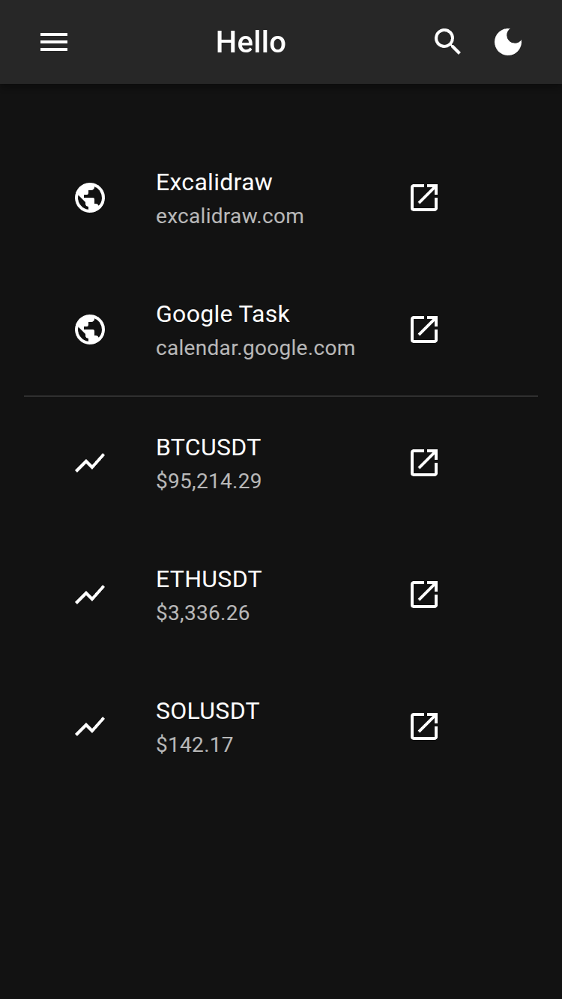

# hello

Self-hosted dashboard



## Usage

### Configuration

```bash
touch settings.json
```

```json
{
  "applications": [
    {
      "name": "Excalidraw",
      "url": "https://excalidraw.com"
    },
    {
      "name": "Google Task",
      "url": "https://calendar.google.com/tasks"
    }
  ],
  "crypto": [
    {
      "name": "Bitcoin",
      "ticker": "BTC"
    },
    {
      "name": "Ethereum",
      "ticker": "ETH"
    },
    {
      "name": "Solana",
      "ticker": "SOL"
    }
  ]
}
```

### With Docker Compose

#### Requirements

- [Docker](https://docker.com/)
- [Docker Compose](https://docker.com/compose)

#### Setup

```bash
touch compose.yml
```

```yaml
services:
  hello-web:
    container_name: hello-web
    restart: unless-stopped
    image: aminnairi/hello-web:0.1.0
    ports:
      - 8001:8001
  hello-server:
    container_name: hello-server
    restart: unless-stopped
    image: aminnairi/hello-server:0.1.0
    ports:
      - 8000:8000
    volumes:
      - ./settings.json:/home/node/settings.json
```

#### Start

```bash
docker compose up -d
```

### With Docker

#### Requirements

- [Docker](https://docker.com/)

#### Start

```bash
docker run -itp 8000:8000 -v ./settings.json:/home/node/settings.json aminnairi/hello-server:0.1.0
docker run -itp 8001:8001 aminnairi/hello-web:0.1.0
```

## Development

### Requirements

- [Docker](https://docker.com/)
- [Docker Compose](https://docker.com/compose)

```json
{
  "applications": [
    {
      "name": "Excalidraw",
      "url": "https://excalidraw.com"
    },
    {
      "name": "Google Task",
      "url": "https://calendar.google.com/tasks"
    }
  ],
  "crypto": [
    {
      "name": "Bitcoin",
      "ticker": "BTC"
    },
    {
      "name": "Ethereum",
      "ticker": "ETH"
    },
    {
      "name": "Solana",
      "ticker": "SOL"
    }
  ]
}
```

### Start

```bash
docker compose up -d
docker compose exec node npm i
docker compose exec node npm -w applications/server run dev
docker compose exec node npm -w applications/web run dev
```
